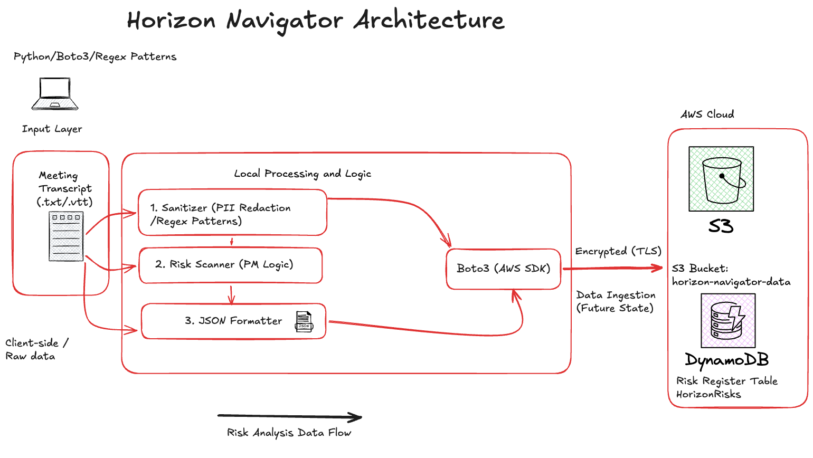

# 🚀 Horizon Navigator: AI-Driven Risk Management

**Horizon Navigator** is a cloud-native engine designed to bridge the gap between unstructured project communication and actionable data-driven governance. By combining **PMP-aligned risk logic** with a **Python-to-AWS pipeline**, it transforms raw meeting transcripts into a secure, structured Risk Register in seconds.

---

### 🎯 The Problem: Information Overload
Modern project management tools (Zoom, Teams, Google Meet) generate massive amounts of "Digital Exhaust." For a PM, manually auditing hours of transcripts to identify critical risks, budget blockers, or technical dependencies is a significant bottleneck that delays decision-making.

### ✨ The Solution: Signal over Noise
This engine acts as a strategic filter:

* **Ingestion:** Processes multiple raw transcripts (STT exports).
* **Governance & Security:** Uses Regex-based sanitization to redact PII (emails) locally before cloud transit.
* **PMP Risk Engine:** Categorizes insights into **CRITICAL**, **MODERATE**, or **MINOR** tiers using an industry-aligned keyword matrix.
* **Cloud Persistence:** Orchestrates a dual-path sync to **Amazon S3** (Audit Trail) and **Amazon DynamoDB** (Live Risk Register).

---

### 🛠️ Tech Stack
* **Language:** Python 3.x
* **Cloud:** AWS (S3, DynamoDB)
* **SDK:** Boto3
* **DevOps:** Environment-based configuration for scalability.



---

### 📂 Project Artifacts
This repository contains:

* `navigator_core.py`: The core processing and cloud-sync engine.
* `ai_project_transcripts.txt`: Sample raw data representing 16 project sync meetings.
* **Architecture Diagram:** Visualizing the data flow from local ingestion to NoSQL indexing.

---

### 🚀 Getting Started

**1. Configure AWS Credentials**
Ensure your local environment is authenticated via the AWS CLI.

**2. Install Dependencies**
```bash
pip install boto3

```

**3. Run the Engine**

```bash
python3 navigator_core.py

```

---

### 👨‍💻 Author

**Carlos Arriaga, PMP** *Bridging the gap between Technical Engineering and Strategic Project Leadership.*
